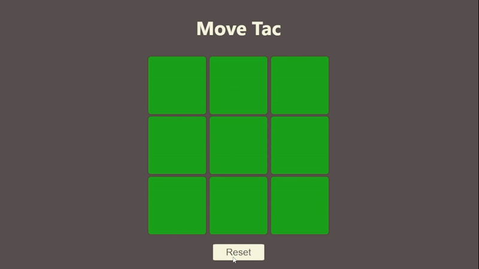

# 🎮 **MoveTac**



> **Placement phase → Movement phase → Win**

---

## 🧠 **What is MoveTac?**

**MoveTac** is a **strategic twist on Tic Tac Toe**, built with **React**.
After placing 3 pieces each, players **move their existing pieces** to form winning lines, adding **state management and turn-based logic** beyond the classic game.

---

## 🎯 **Gameplay Summary**

* **Board:** 3 × 3
* **Players:** X and O
* **Phases:**

  * **Placement Phase:** Each player places **3 pieces**
  * **Movement Phase:** Players move **one piece per turn**
* **Allowed Moves:** Up, Down, Left, Right *(no diagonals)*
* **Win Condition:** Three in a row (horizontal, vertical, or diagonal)
* Winning can occur in **either phase**

---

## ✨ **Key Features**

* 🔄 Two-phase game logic (Placement → Movement)
* ✨ Selected piece glow
* ✅ Valid move highlighting
* ❌ Illegal move prevention
* ⚛️ Fully **state-driven React UI** 

---

## 🛠️ **Tech Stack**

* **React** (Hooks)
* **JavaScript (ES6+)**
* **HTML**
* **CSS**

---

## 🚀 **Run Locally**

```bash
git clone https://github.com/your-username/movetac.git
cd movetac
npm install
npm start
```

App runs at:

```
http://localhost:3000
```

---

## 🧩 **What This Project Demonstrates**

* Managing **complex UI state** in React
* Turn-based game design
* Multi-phase rule enforcement
* Conditional rendering based on state
* Clean separation of logic and UI

---

## 🔮 **Future Enhancements**

* 🎞️ Smooth movement animations
* 🌐 Multiplayer support
* 📱 Mobile responsiveness

---

## ⭐ **Feedback**

If you found this project interesting, feel free to ⭐ the repo!

---